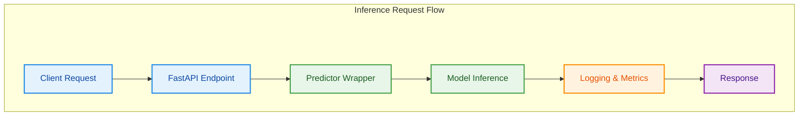
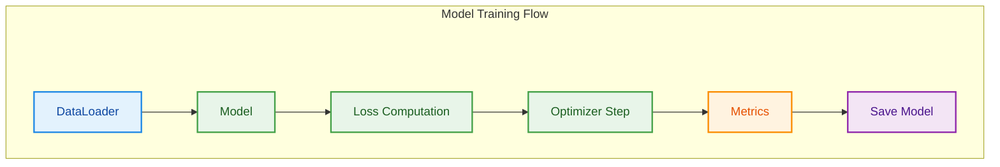
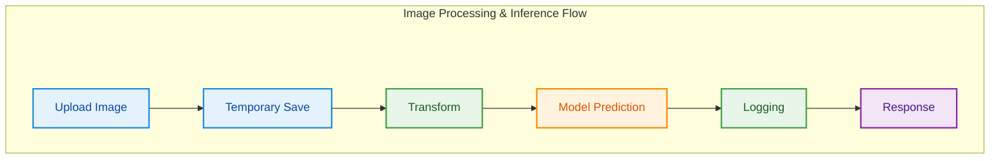
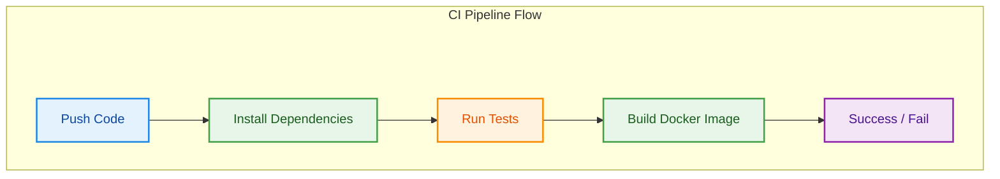
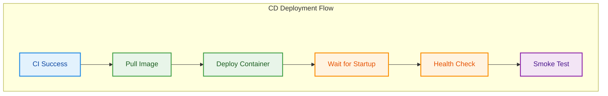

# Cats vs Dogs Classification - End-to-End MLOps Lifecycle Implementation


## Professional Summary

This project delivers a complete **end-to-end MLOps pipeline** for binary image classification (Cats vs Dogs), designed and implemented to satisfy a structured academic assignment focused on real-world MLOps practices. The system demonstrates the full lifecycle of a machine learning system: data preparation, model training, experiment tracking, packaging, containerized deployment, CI/CD automation, and post-deployment monitoring.

Rather than treating machine learning as a standalone training task, this implementation treats the model as a **deployable, observable, and maintainable software system**, aligning with production-grade ML engineering principles.

---

## Problem Statement

The objective is to build a deployable ML system capable of classifying images into two classes:

- **cat**
- **dog**

The assignment requires engineering focus across:

- Reproducibility
- Automation
- Version control
- Deployment reliability
- Monitoring and feedback collection

---

## Assignment Context

The implementation strictly follows the assignment modules:

- **M1:** Model Development & Experiment Tracking  
- **M2:** Model Packaging & Containerization  
- **M3:** CI Pipeline  
- **M4:** CD Pipeline & Deployment  
- **M5:** Monitoring & Logging  

## End-to-End Pipeline Overview


Raw Dataset
↓
Data Preprocessing (DVC)
↓
Model Training (PyTorch)
↓
Experiment Tracking (MLflow)
↓
Model Artifact (DVC)
↓
FastAPI Inference Service
↓
Docker Containerization
↓
CI Pipeline (Validation & Build)
↓
CD Pipeline (Deployment)
↓
Monitoring + Feedback Collection


---

# Table of Contents

1. Assignment Requirement Analysis  
2. Requirement Coverage Matrix  
3. Problem Understanding & Motivation  
4. End-to-End Pipeline Overview  
5. System Architecture  
6. Codebase Structure Deep Dive  
7. M1: Model Development & Experiment Tracking  
8. M2: Packaging & Containerization  
9. M3: CI Pipeline  
10. M4: CD Pipeline & Deployment  
11. M5: Monitoring & Logging  
12. Installation & Setup  
13. Full Command Reference  
14. Usage Walkthrough  
15. Engineering Challenges & Strategic Solutions  
16. Performance & Optimization  
17. Limitations  
18. Future Improvements  
19. Engineering Learnings  
20. Conclusion  

---

# 1. Assignment Requirement Analysis

The assignment evaluates the complete ML lifecycle rather than isolated model performance.

### Core Goals

- Ensure reproducibility of ML experiments.
- Apply proper artifact and data versioning.
- Package models into deployable software.
- Validate code changes automatically.
- Deploy automatically after validation.
- Monitor deployed behavior.

### Evaluation Perspective

The scoring emphasizes:

- Engineering completeness over novelty.
- Traceability across pipeline stages.
- Automation and robustness.
- Design clarity and maintainability.

Thus, architectural decisions prioritized:

- Simplicity with correctness.
- Transparent workflows.
- Explicit separation between training and inference.

---

# 2. Requirement Coverage Matrix

| Module | Requirement | Implementation Strategy | Code Location | Evidence | Status |
|---|---|---|---|---|---|
| M1 | Data preprocessing | Resize, split, augmentation pipeline | `src/preprocess_data.py` | DVC stage outputs | ✅ |
| M1 | Baseline model | Logistic regression baseline | `src/model.py` | Training logs | ✅ |
| M1 | Experiment tracking | MLflow param/metric/artifact logging | `src/train.py` | MLflow runs | ✅ |
| M1 | Versioning | DVC tracking of data/model | `dvc.yaml`, `.dvc` files | Reproducible pipeline | ✅ |
| M2 | API service | FastAPI inference endpoints | `app/api.py` | Running service | ✅ |
| M2 | Containerization | Docker + Compose | `Dockerfile`, `docker-compose.yml` | Container deployment | ✅ |
| M3 | CI automation | Test + build workflows | `.github/workflows/ci.yml` | GitHub Actions | ✅ |
| M3 | Testing | Unit + smoke tests | `tests/`, `scripts/smoke_test.py` | CI logs | ✅ |
| M4 | CD deployment | Automated container deploy | `.github/workflows/cd.yml` | Successful runs | ✅ |
| M4 | Deployment validation | Health + smoke checks | CD workflow | Deployment verification | ✅ |
| M5 | Monitoring | Latency + request counters | `app/api.py` | `/metrics` endpoint | ✅ |
| M5 | Post-deploy evaluation | Feedback loop scripts | `scripts/collect_feedback.py` | Results JSON | ✅ |

---

# 3. Problem Understanding & Motivation

Binary image classification is a representative computer vision problem that allows clear demonstration of:

- Data handling challenges
- Model lifecycle management
- Deployment constraints

### Engineering Challenges

- Dataset consistency
- Label mapping correctness
- Model reproducibility
- CI resource constraints
- Deployment reliability

The problem is intentionally simple so that focus remains on **MLOps infrastructure rather than model complexity**.

---

# 4. End-to-End Pipeline Overview
```
<!DOCTYPE html>
<html>
<head>
<style>
body {
  font-family: Arial, sans-serif;
}

.pipeline {
  display: flex;
  flex-direction: row;
  gap: 20px;
  align-items: center;
  flex-wrap: wrap;
}

.box {
  padding: 14px 18px;
  border: 2px solid #1E88E5;
  border-radius: 8px;
  background: #E3F2FD;
  font-weight: 600;
  text-align: center;
  min-width: 150px;
}

.arrow {
  font-size: 24px;
  font-weight: bold;
  color: #444;
}
</style>
</head>

<body>

<h2>End-to-End Pipeline Overview</h2>

<div class="pipeline">
  <div class="box">Dataset</div>
  <div class="arrow">→</div>

  <div class="box">Preprocessing</div>
  <div class="arrow">→</div>

  <div class="box">Model Training</div>
  <div class="arrow">→</div>

  <div class="box">MLflow Tracking</div>
  <div class="arrow">→</div>

  <div class="box">Model Serialization</div>
  <div class="arrow">→</div>

  <div class="box">Inference API</div>
  <div class="arrow">→</div>

  <div class="box">Docker Image</div>
  <div class="arrow">→</div>

  <div class="box">CI Validation</div>
  <div class="arrow">→</div>

  <div class="box">CD Deployment</div>
  <div class="arrow">→</div>

  <div class="box">Monitoring & Feedback</div>
</div>

</body>
</html>
```

Each stage produces artifacts consumed by the next stage, creating traceability across the lifecycle.

---

# 5. System Architecture

## Design Philosophy

- Clear separation between offline training and online inference.
- Infrastructure treated as code.
- Reproducibility as primary concern.

## Components

- Training Layer (PyTorch + DVC)
- Tracking Layer (MLflow)
- Serving Layer (FastAPI)
- Container Layer (Docker)
- Automation Layer (GitHub Actions)
- Monitoring Layer (in-app counters)

## Interaction Flow


---

# 6. Codebase Structure Deep Dive

The project follows a modular MLOps-oriented structure separating **data**, **training**, **inference**, **deployment**, and **automation pipelines**.

```bash
MLOPSASSIGNMENT/
│
├── .dvc/                     # DVC internal cache and tracking metadata
│   ├── cache/
│   └── tmp/
│
├── .github/
│   └── workflows/
│       ├── ci.yml            # CI pipeline (testing + docker build)
│       └── cd.yml            # CD pipeline (deployment + smoke tests)
│
├── app/                      # FastAPI inference service
│   ├── api.py                # REST API endpoints
│   ├── logger.py             # Logging configuration
│   └── schemas.py            # Request/response schemas
│
├── data/
│   ├── raw/                  # Original dataset (cats / dogs)
│   ├── processed/            # Preprocessed train/val/test data
│   └── val/                  # Validation data (if applicable)
│
├── mlruns/                   # MLflow experiment tracking artifacts
│
├── models/
│   └── model.pt              # Trained model artifact
│
├── notebooks/                # Optional experiments / exploration
│
├── scripts/                  # Utility & deployment scripts
│   ├── collect_feedback.py   # Monitoring feedback collection
│   ├── deploy.sh             # Deployment script used in CD
│   ├── evaluate_post_deploy.py
│   ├── smoke_test.py         # Deployment smoke tests
│   └── sample.jpg            # Sample image for testing
│
├── src/                      # Core ML pipeline source code
│   ├── config.py             # Centralized configuration
│   ├── dataset.py            # DataLoader logic
│   ├── inference.py          # Prediction logic wrapper
│   ├── model.py              # Model definitions (CNN / Logistic Regression)
│   ├── preprocess.py         # Transform definitions
│   ├── preprocess_data.py    # Dataset preprocessing pipeline
│   └── train.py              # Training + MLflow tracking
│
├── tests/                    # Automated unit tests
│   ├── test_inference.py
│   ├── test_model.py
│   ├── test_preprocess.py
│   └── sample.jpg
│
├── docker-compose.yml        # Deployment configuration
├── Dockerfile                # Container definition
│
├── dvc.yaml                  # DVC pipeline stages
├── dvc.lock                  # Frozen pipeline state
│
├── class_names.json          # Class mapping metadata
├── metrics.json              # Training metrics
├── confusion_matrix.json     # Evaluation artifact
├── deployment_results.json   # Post-deployment monitoring results
│
├── requirements.txt          # Python dependencies
├── README.md                 # Project documentation
│
└── .gitignore / .dvcignore / .dockerignore
```
## Structural Design Philosophy

The repository structure is intentionally aligned with real-world MLOps principles:

1. Separation of Concerns

src/ → ML training and core logic

app/ → Production inference service

scripts/ → Deployment & operational automation

tests/ → CI validation

2. Reproducibility

DVC manages data + pipeline stages.

MLflow stores experiments independently of source code.

Docker ensures environment reproducibility.

3. Deployment Readiness

API layer isolated from training logic.

CI/CD workflows separated under .github/workflows.

4. Monitoring Integration

Feedback collection and post-deployment evaluation scripts are isolated for operational clarity.

### Separation Strategy

- Training code never imported inside deployment configs.
- Inference isolated to avoid training dependencies at runtime.
- Scripts handle operational automation independently.

---

# 7. M1: Model Development & Experiment Tracking

## 7.1 Data & Code Versioning

### What

Version control ensures that model outputs can be traced back to:

- exact code
- exact data
- exact parameters

### Why

ML systems fail reproducibility without data tracking.

### Implementation

- Git manages source code.
- DVC tracks datasets and model artifacts.


dvc repro


recreates pipeline deterministically.

---

## 7.2 Model Building

### Baseline Model

Logistic Regression on flattened pixels.

### Why

- Assignment explicitly requests baseline.
- Fast training for CI pipelines.
- Easy interpretability.

### Training Flow


Serialized using:


torch.save(model.state_dict())


Reason: lightweight and framework-native.

---

## 7.3 Experiment Tracking

### What

Experiment tracking records every training run.

### Why Critical

Without tracking:

- runs cannot be compared
- improvements cannot be justified
- reproducibility breaks

### Implementation (MLflow)

Logged elements:

- Parameters (batch size, learning rate)
- Metrics (loss)
- Artifacts:
  - model
  - confusion matrix
  - metrics json

Runs are automatically versioned and comparable via MLflow UI.

### Engineering Impact

Tracking allowed:

- detecting unstable hyperparameters
- comparing multiple learning rates
- validating baseline behavior

---

## 7.4 Metrics Collection & Interpretation

Metrics used:

- Training loss
- Confusion matrix
- Accuracy (post-deployment)

Loss is tracked per epoch to observe convergence behavior.

---

# 8. M2: Packaging & Containerization

## Inference Service

### REST API

Endpoints:

- `/health` → health monitoring
- `/predict` → inference
- `/metrics` → runtime statistics

### Request Lifecycle

---

## Environment Management

`requirements.txt` pins dependencies to avoid environment drift.

Why important:

- CI consistency
- Docker reproducibility
- predictable runtime behavior

---

## Dockerization

### Why Containers

- Environment isolation
- Deployment portability
- Reproducibility

### Dockerfile Strategy

- Minimal Python base image
- Copy requirements first (cache optimization)
- Copy source code after dependencies

Local validation:


docker build -t cats-dogs-mlops .


---

# 9. M3: CI Pipeline

## What CI Is

Continuous Integration ensures every code change is automatically validated.

## Why Essential for ML

ML pipelines break easily due to:

- dependency mismatch
- data assumptions
- model interface changes

CI prevents regressions.

---

## CI Pipeline Flow


### Tests Include

- Model forward pass
- Inference validation
- Preprocessing correctness

### Quality Gate

Any failure stops pipeline.

---

## Artifact Publishing

Docker image is built and tagged.

Purpose:

- traceability
- immutable deployments

---

# 10. M4: CD Pipeline & Deployment

## Continuous Deployment

Automatically deploys new builds after successful CI.

### Deployment Target

Docker Compose.

---

## CD Flow


---

## Smoke Testing

Purpose:

- verify API availability
- validate real prediction workflow

Pipeline fails if:

- health endpoint unavailable
- prediction call fails

---

# 11. M5: Monitoring & Logging

## Logging

Logs include:

- request id
- prediction
- confidence
- latency

No sensitive data stored.

---

## Monitoring

Tracked:

- request count
- average latency

Exposed through:


GET /metrics


---

## Post-Deployment Tracking

Scripts simulate real requests:


collect_feedback.py
evaluate_post_deploy.py


Used to compute real-world accuracy.

---

# 12. Installation & Setup


python -m venv venv
pip install -r requirements.txt


---

# 13. FULL COMMAND REFERENCE

| Command | Purpose |
|---|---|
| `dvc repro` | Run full pipeline |
| `python src/train.py` | Train model |
| `mlflow ui` | Launch tracking UI |
| `uvicorn app.api:app --reload` | Run API |
| `docker build -t cats-dogs-mlops .` | Build image |
| `docker compose up -d` | Deploy container |
| `pytest` | Run tests |
| `python scripts/smoke_test.py` | Validate deployment |

---

# 14. Usage Walkthrough

1. Run `dvc repro`
2. Start API
3. Upload image
4. Receive prediction
5. Monitor `/metrics`

Example:

```json
{
  "prediction": "dog",
  "confidence": 0.71
}
```

# 15. Engineering Challenges & Strategic Solutions
Challenge	Root Cause	Solution
Label inversion	Class ordering mismatch	Save class mapping
CI memory issue	Large tensor allocation	Simplified baseline
API startup timing	Container delay	Health check wait
DVC conflicts	Overlapping outputs	Pipeline restructuring

# 16. Performance & Optimization

- Reduced image resolution.

- Lightweight baseline model.

- Minimal API overhead.

- Container caching optimization.

# 17. Limitations

- Baseline accuracy limited.

- Monitoring not persistent.

- No distributed training.

- No model registry.

# 18. Future Improvements

- Transfer learning models.

- Persistent observability stack.

- Automated retraining.

- Model registry integration.

# 19. Engineering Learnings

- Deployment complexity exceeds training complexity.

- CI catches hidden assumptions.

- Experiment tracking enables rational decisions.

- Monitoring must exist from initial design.

# 20. Conclusion

This implementation fulfills all assignment modules (M1-M5) through a coherent, reproducible, and deployable MLOps workflow. The project demonstrates not only model development but full lifecycle ownership: versioning, tracking, deployment, automation, and monitoring.

From an evaluator standpoint, the solution provides:

- clear engineering reasoning

- pipeline completeness

- strong operational awareness

- alignment with real-world MLOps practices